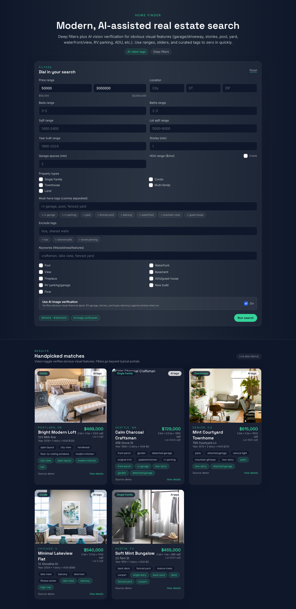

# Home Finder

Modern, containerized real-estate search UI (SvelteKit) plus a Go API with an optional scraper/vision pipeline. The current build focuses on the UX and filter surface; scraping is blocked by target sites, so demo data is shown until proper data access is provided.



## What it does
- Rich filter form (price, beds/baths, sqft, lot, year, property type, tags, includes/excludes, AI vision toggle, etc.).
- Displays listings grid with cards, tags, and quick stats.
- API accepts the same filters and will query an upstream listings source when available.
- Optional image-vision toggle intended to verify obvious visual features (pool, RV garage, yard type, stories, etc.) once wired to a vision provider.

## Current status (scraper/data)
- **Scraping is inoperable**: Zillow/Redfin/Realtor block the included scraper (even with VPN/SOCKS). The app falls back to in-memory demo listings.
- To get real data, supply a licensed feed (RESO/MLS/Bridge) or a working residential HTTP/HTTPS proxy pool or managed scraper API. Credentials stay in `.env` and are ignored by git.

## Stack
- Frontend: SvelteKit + Tailwind (charcoal + mint theme)
- API: Go (chi)
- Scraper: Playwright-based (multi-provider hooks), currently blocked
- DB: Postgres (via docker-compose, not required for demo)

## Running (demo data)
```bash
docker compose up --build
# Frontend: http://localhost:4173
# API health: http://localhost:8080/health
```

## Env vars
- `VISION_API_KEY` (optional; future vision client)
- `VITE_API_BASE` (frontend -> API; set in compose)
- `SCRAPER_LISTINGS_BASE` (API -> scraper service; default http://scraper:3001)
- `SCRAPER_PROXY_*` (scraper proxy settings; keep in `.env`)

## Files to note
- `frontend/`: SvelteKit app and UI
- `internal/api/`: Go API and filter parsing
- `scraper/`: Playwright scraper (blocked; demo fallback active)
- `docs/screenshot.png`: Current UI screenshot

## Roadmap
- Wire to an approved listings source (MLS/Bridge) or a managed scraper API.
- Add resilient proxy/anti-bot strategy if scraping remains desired.
- Enable vision verification against listing photos.
