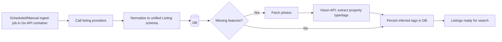

# Home Finder – Containerized Architecture

## Overview
```
┌──────────────────────┐      ┌──────────────────────┐
│      Frontend        │      │   Vision Provider    │
│  (SvelteKit + SSR)   │      │ (GPT-4o mini vision) │
│  Container           │      │  Managed service     │
└─────────┬────────────┘      └──────────┬───────────┘
          │                               │
          │ HTTP (443)                    │ HTTPS API
          ▼                               ▼
┌────────────────────────────────────────────────────┐
│                    API Gateway                     │
│        (Go HTTP API Container, REST/JSON)          │
└─────────┬───────────────────────────────┬─────────┘
          │                               │
          │ DB access (internal)          │ Provider calls
          │                               │ (MLS/aggregators)
          ▼                               ▼
┌──────────────────────┐      ┌──────────────────────┐
│   Postgres/SQLite    │      │ Listing Providers     │
│   Container/Volume   │      │ (MLS/aggregators API) │
└──────────────────────┘      └──────────────────────┘
```

## Request Flow (search)
```mermaid
flowchart TD
    A[User browser] --> B[Frontend container (SvelteKit)]
    B -->|REST/JSON| C[Go API container]
    C -->|SQL| D[(Postgres/SQLite)]
    C -->|If enrichment needed| E[Vision API]
    B <-->|SSR/JSON response| C
```

## Data Pipeline (ingest + enrich)


## Containers
- **frontend**: SvelteKit + Tailwind; served via Node adapter (or static if feasible). Talks only to API over HTTP(S).
- **api**: Go HTTP server exposing REST endpoints for search, listing detail, ingest triggers. Performs provider fetches and vision enrichment.
- **db**: Postgres (recommended) with a named volume; SQLite acceptable for dev/single-node demo.
- **(optional) worker**: same image as API; can run ingest on a schedule (or cron in host/CI).

## Networking & URLs
- Internal Docker network: `frontend` → `api` (`http://api:8080`), `api` → `db` (`postgres:5432`).
- External: expose `frontend:4173` (dev) or `frontend:80/443` (prod); optionally expose `api:8080` if you want direct API access.

## Secrets & Config
- `.env` mounted into containers (or Docker secrets): provider API keys, vision API key, DB URL.
- Configurable ingest interval; provider selection; model choice for vision (e.g., GPT-4o mini vision).

## Modern UI Notes
- Clean cards, rounded corners, soft shadows, two-tone palette (choose: deep teal + sand _or_ charcoal + mint), bold headline font (e.g., Space Grotesk/Sora), subtle gradient header, hover motion on cards.

## Next Steps
- Confirm palette: **deep teal + sand** or **charcoal + mint**.
- I’ll scaffold the containers (`docker-compose.yml`), Go API skeleton, SvelteKit+Tailwind frontend, shared types, and stubbed provider/vision clients.
